## Vue是什么？为什么要学习他


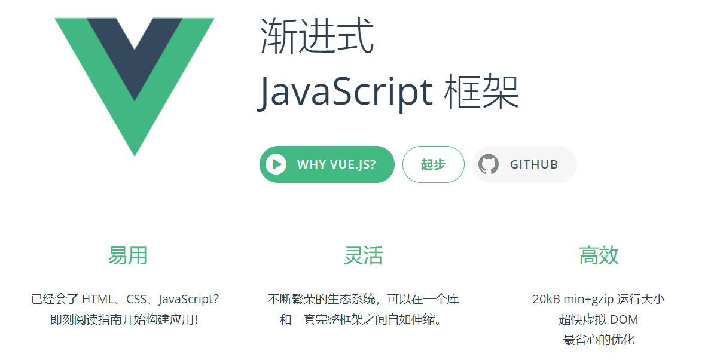


### Vue是什么？

Vue是前端优秀框架， 是一套用于构建用户界面的**渐进式框架**


### 为什么要学习Vue

1. Vue是目前前端最火的框架之一
2. Vue是目前企业技术栈中要求的知识点
3. Vue可以提升开发体验
4. Vue学习难度较低
5. ...


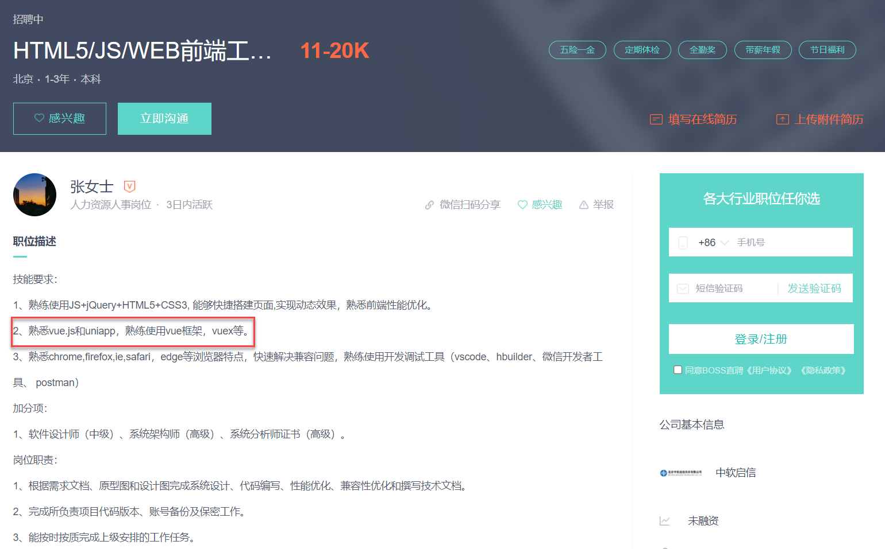


## Vue开发前的准备


### 安装Vue工具 `Vue CLI`

`Vue CLI` Vue.js 开发的标准工具，`Vue CLI ` 是一个基于 Vue.js 进行快速开发的完整系统

```js
npm install -g @vue/cli
```

安装之后，你就可以在命令行中访问 `vue` 命令。你可以通过简单运行 `vue`，看看是否展示出了一份所有可用命令的帮助信息，来验证它是否安装成功。

```js
vue --version
```


### 创建一个项目

运行以下命令来创建一个新项目

```js
vue create vue-demo
```

> **温馨提示**
>
> 在控制台中，可以用上下按键调整选择项
>
> 在控制台中，可以用空格(spacebar)选择是否选中和取消选中

可以选择默认项目模板，或者选“手动选择特性”来选取需要的特性。

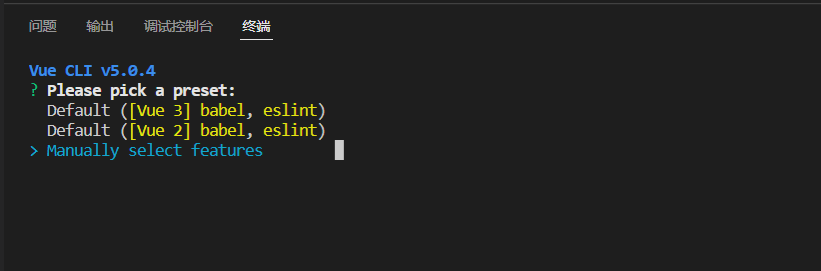

我们选择`Babel`和`Progressive Web App (PWA) Support` 两个选项即可

> **温馨提示**
>
> 在学习期间，不要选中 `Linter / Formatter` 以避免不必要的错误提示

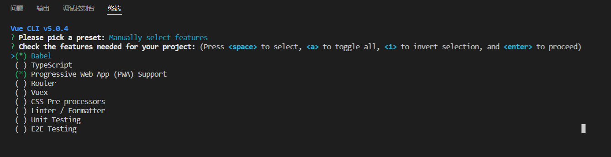

Vue目前有两个主流大版本`vue2`和`vue3`，我们本套课程选择`vue3`最新版本

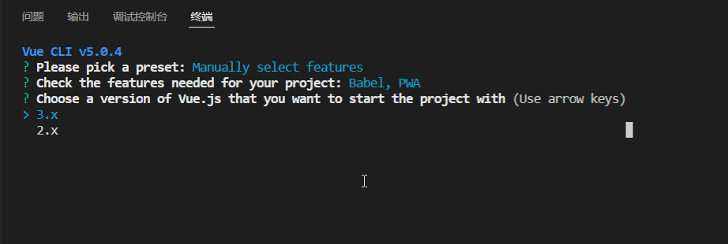

配置放在哪里? `In dedicated config files ` 专用配置文件或者 `In package.json `在package.json文件

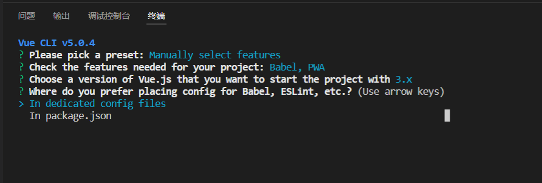

将其保存为未来项目的预置? `y`代表保存，并添加名字，`n`不保存

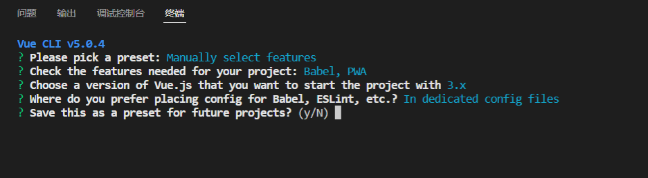

项目创建成功如下提示信息

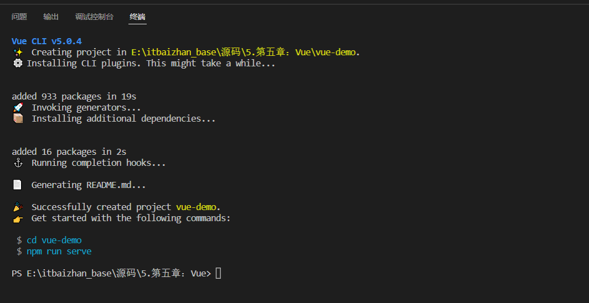


### 运行项目

第一步：进入项目根目录`cd vue-demo`

第二步：运行`npm run serve` 启动项目


### 安装Vue高亮插件

VSCode中安装`vetur`或者`volar`都可，前者针对Vue2版本，后者针对Vue3版本


## 模板语法


### 文本

数据绑定最常见的形式就是使用“Mustache” (双大括号) 语法的文本插值

```html
<span>Message: {{ msg }}</span>
```

一般配合`js` 中的`data()`设置数据

```js
export default {
  name: 'HelloWorld',
  data(){
    return{
      msg:"消息提示"
    }
  }
}
```


### 原始 HTML

双大括号会将数据解释为普通文本，而非 HTML 代码。为了输出真正的 HTML，你需要使用`v-html` 指令

```html
<p>Using mustaches: {{ rawHtml }}</p>
<p>Using v-html directive: <span v-html="rawHtml"></span></p>
```

```js
data(){
    return{
        rawHtml:"<a href='https://www.itbaizhan.com'>百战</a>"
    }
}
```


### 属性 Attribute

Mustache 语法不能在 HTML 属性中使用，然而，可以使用 `v-bind` 指令

```html
<div v-bind:id="dynamicId"></div>
```

```js
data(){
    return{
        dynamicId:1001
    }
}
```

> **温馨提示**
>
> `v-bind:` 可以简写成 `:`


### 使用 JavaScript 表达式

在我们的模板中，我们一直都只绑定简单的 property 键值，Vue.js 都提供了完全的 JavaScript 表达式支持

```js
{{ number + 1 }}

{{ ok ? 'YES' : 'NO' }}

{{ message.split('').reverse().join('') }}
```

这些表达式会在当前活动实例的数据作用域下作为 JavaScript 被解析。有个限制就是，每个绑定都只能包含**单个表达式**，所以下面的例子都**不会**生效。

```js
<!--  这是语句，不是表达式：-->
{{ var a = 1 }}

<!-- 流程控制也不会生效，请使用三元表达式 -->
{{ if (ok) { return message } }}
```


## 条件渲染


### v-if

`v-if` 指令用于条件性地渲染一块内容。这块内容只会在指令的表达式返回 `true` 值的时候被渲染。

```html
<p v-if="flag">我是孙猴子</p>
```

```js
data() {
    return {
        flag: true
    }
}
```


### v-else

你可以使用 `v-else` 指令来表示 `v-if` 的“else 块”

```html
<p v-if="flag">我是孙猴子</p>
<p v-else>你是傻猴子</p>
```

```js
data() {
    return {
        flag: false
    }
}
```


### v-show

另一个用于条件性展示元素的选项是 `v-show` 指令

```html
<h1 v-show="ok">Hello!</h1>
```


### `v-if` vs `v-show` 的区别

`v-if` 是“真正”的条件渲染，因为它会确保在切换过程中，条件块内的事件监听器和子组件适当地被销毁和重建。

`v-if` 也是**惰性的**：如果在初始渲染时条件为假，则什么也不做——直到条件第一次变为真时，才会开始渲染条件块。

相比之下，`v-show` 就简单得多——不管初始条件是什么，元素总是会被渲染，并且只是简单地基于 CSS 进行切换。

一般来说，`v-if` 有更高的切换开销，而 `v-show` 有更高的初始渲染开销。因此，如果需要非常频繁地切换，则使用 `v-show` 较好；如果在运行时条件很少改变，则使用 `v-if` 较好


## 列表渲染


### 用 `v-for` 把一个数组映射为一组元素

我们可以用 `v-for` 指令基于一个数组来渲染一个列表。`v-for` 指令需要使用 `item in items` 形式的特殊语法，其中 items 是源数据数组，而 `item` 则是被迭代的数组元素的**别名**。

```html
<ul>
    <li v-for="item in items">{{ item.message }}</li>
</ul>
```

```js
data() {
    return {
        items: [{ message: 'Foo' }, { message: 'Bar' }]
    }
}
```


### 维护状态

当 Vue 正在更新使用 `v-for` 渲染的元素列表时，它默认使用“就地更新”的策略。如果数据项的顺序被改变，Vue 将不会移动 DOM 元素来匹配数据项的顺序，而是就地更新每个元素，并且确保它们在每个索引位置正确渲染。

为了给 Vue 一个提示，以便它能跟踪每个节点的身份，从而重用和重新排序现有元素，你需要为每项提供一个唯一的 `key` attribute：

```html
<div v-for="(item,index) in items" :key="item.id|index">
  <!-- 内容 -->
</div>
```


## 事件处理


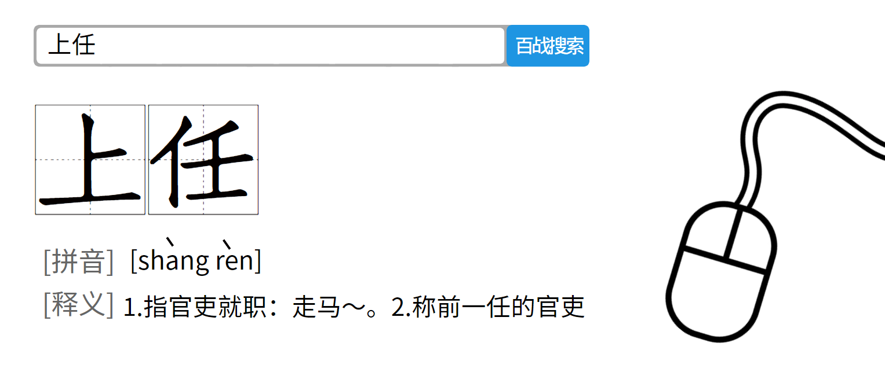


### 监听事件


我们可以使用 `v-on` 指令 (通常缩写为 `@` 符号) 来监听 DOM 事件，并在触发事件时执行一些 JavaScript。用法为 `v-on:click="methodName"` 或使用快捷方式 `@click="methodName"`

```html
<button @click="counter += 1">Add 1</button>
```

```js
data() {
    return {
        counter: 0
    }
}
```


### 事件处理方法

然而许多事件处理逻辑会更为复杂，所以直接把 JavaScript 代码写在 `v-on` 指令中是不可行的。因此 `v-on` 还可以接收一个需要调用的方法名称。

```html
<button @click="greet">Greet</button>
```

```js
methods: {
    greet(event) {
        // `event` 是原生 DOM event
        if (event) {
            alert(event.target.tagName)
        }
    }
}
```


### 内联处理器中的方法

这是官方的翻译称呼，其实我们可以直接叫他 "事件传递参数"

```html
<button @click="say('hi')">Say hi</button>
<button @click="say('what')">Say what</button>
```

```js
methods: {
    say(message) {
        alert(message)
    }
}
```


## 表单输入绑定


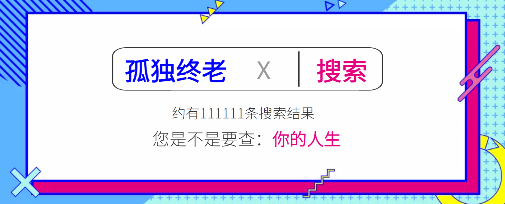


你可以用 `v-model` 指令在表单 `<input>`、`<textarea>` 及 `<select>` 元素上创建双向数据绑定。它会根据控件类型自动选取正确的方法来更新元素。尽管有些神奇，但 `v-model` 本质上不过是语法糖。它负责监听用户的输入事件来更新数据，并在某种极端场景下进行一些特殊处理。

```html
<input v-model="message" placeholder="edit me" />
<p>Message is: {{ message }}</p>
```

```js
data() {
    return {
        message:""
    }
}
```


### 修饰符

#### `.lazy`

在默认情况下，`v-model` 在每次 `input` 事件触发后将输入框的值与数据进行同步 。你可以添加 `lazy` 修饰符，从而转为在 `change` 事件之后进行同步

```html
<input v-model.lazy="message" />
<p>Message is: {{ message }}</p>
```

```js
data() {
    return {
        message:""
    }
}
```


#### `.trim`

如果要自动过滤用户输入的首尾空白字符，可以给 `v-model` 添加 `trim` 修饰符

```html
<input v-model.trim="message" />
```

```js
data() {
    return {
        message:""
    }
}
```


## 组件基础


### 单文件组件

Vue 单文件组件（又名 `*.vue` 文件，缩写为 **SFC**）是一种特殊的文件格式，它允许将 Vue 组件的模板、逻辑 **与** 样式封装在单个文件中

```vue
<template>
    <h3>单文件组件</h3>
</template>

<script>
export default {
    name:"MyComponent"
}
</script>

<style scoped>
h3{
    color: red;
}
</style>
```


### 加载组件

第一步：引入组件 `import MyComponentVue from './components/MyComponent.vue'`

第二步：挂载组件 `components: { MyComponentVue }`

第三步：显示组件 `<my-componentVue />`


### 组件的组织

通常一个应用会以一棵嵌套的组件树的形式来组织

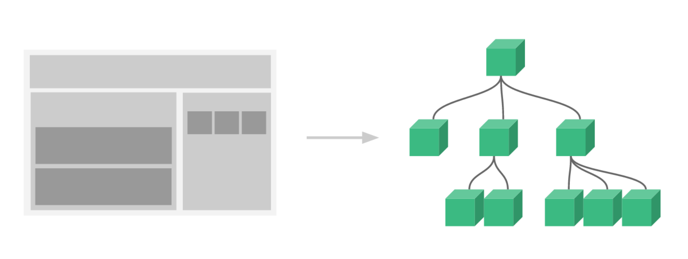

# 


## Props组件交互


组件与组件之间是需要存在交互的，否则完全没关系，组件的意义就很小了

`Prop` 是你可以在组件上注册的一些自定义 attribute

```vue
<my-componentVue title="标题"/>
```

```vue
<template>
    <h3>单文件组件</h3>
    <p>{{ title }}</p>
</template>

<script>
export default {
    name:"MyComponent",
    props:{
        title:{
            type:String,
            default:""
        }
    }
}
</script>
```


### Prop 类型

Prop传递参数其实是没有类型限制的

```vue
props: {
  title: String,
  likes: Number,
  isPublished: Boolean,
  commentIds: Array,
  author: Object,
  callback: Function
}
```

> **温馨提示**
>
> 数据类型为数组或者对象的时候，默认值是需要返回工厂模式


## 自定义事件组件交互


自定义事件可以在组件中反向传递数据，`prop` 可以将数据从父组件传递到子组件，那么反向如何操作呢，就可以利用自定义事件实现 `$emit`

```vue
<template>
    <h3>单文件组件</h3>
    <button @click="sendHandle">发送数据</button>
</template>

<script>
export default {
    name: "MyComponent",
    methods:{
        sendHandle(){
            this.$emit("onCustom","数据")
        }
    }
}
</script>

<style scoped>
h3 {
    color: red;
}
</style>
```

```vue
<template>
  <my-componentVue @onCustom="getData" />
</template>

<script>

import MyComponentVue from './components/MyComponent.vue'

export default {
  name: 'App',
  components: {
    MyComponentVue
  },
  methods: {
    getData(data) {
      console.log(data);
    }
  }
}
</script>
```


## 组件生命周期


每个组件在被创建时都要经过一系列的初始化过程——例如，需要设置数据监听、编译模板、将实例挂载到 DOM 并在数据变化时更新 DOM 等。同时在这个过程中也会运行一些叫做**生命周期钩子**的函数，这给了用户在不同阶段添加自己的代码的机会


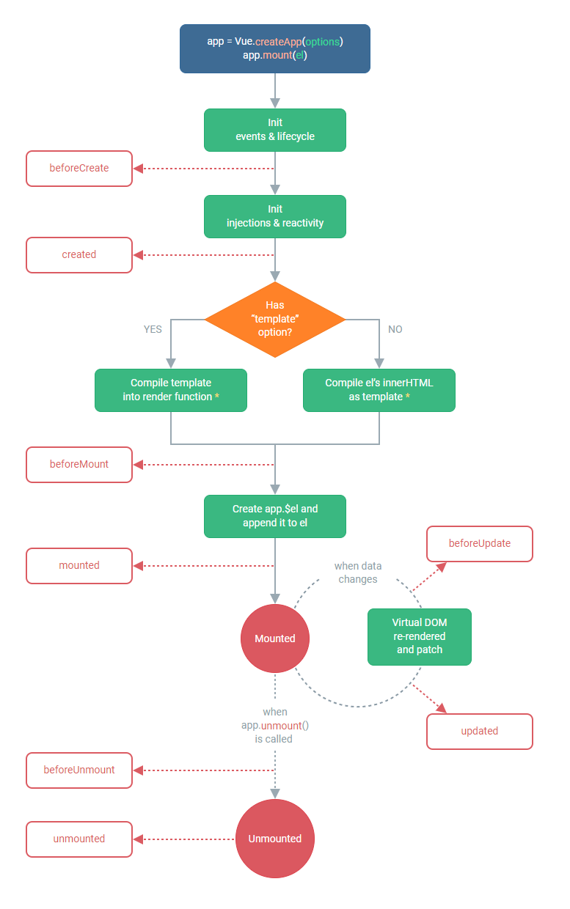


为了方便记忆，我们可以将他们分类：

创建时：`beforeCreate`、`created`

渲染时：`beforeMount`、`mounted`

更新时：`beforeUpdate`、`updated`

卸载时：`beforeUnmount`、`unmounted`


## Vue引入第三方


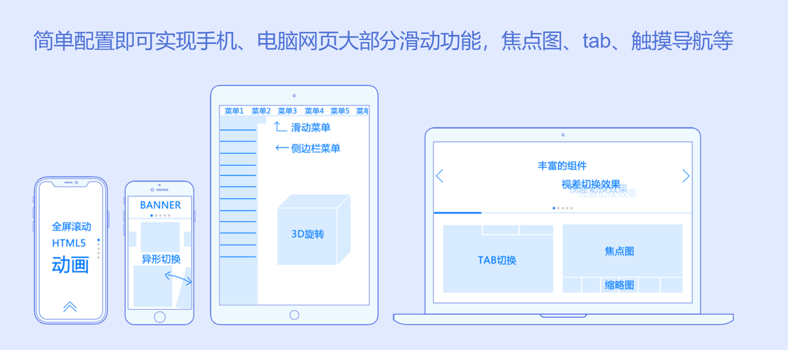


`Swiper` 开源、免费、强大的触摸滑动插件

`Swiper` 是纯javascript打造的滑动特效插件，面向手机、平板电脑等移动终端

`Swiper` 能实现触屏焦点图、触屏Tab切换、触屏轮播图切换等常用效果


>**温馨提示**
>
>官方文档：https://swiperjs.com/vue
>
>安装指定版本: `npm instal --save swiper@8.1.6`


### 基础实现

```vue
<template>
  <div class="hello">
    <swiper class="mySwiper">
      <swiper-slide>Slide 1</swiper-slide>
      <swiper-slide>Slide 2</swiper-slide>
      <swiper-slide>Slide 3</swiper-slide>
    </swiper>
  </div>
</template>

<script>
import { Swiper, SwiperSlide } from 'swiper/vue';
import 'swiper/css';

export default {
  name: 'HelloWorld',
  components: {
    Swiper,
    SwiperSlide,
  }
}
</script>
```


### 添加指示器

```vue
<template>
  <div class="hello">
    <swiper class="mySwiper" :modules="modules" :pagination="{ clickable: true }">
      <swiper-slide>
        
      </swiper-slide>
      <swiper-slide>
        
      </swiper-slide>
      <swiper-slide>
        
      </swiper-slide>
    </swiper>
  </div>
</template>

<script>
import { Pagination } from 'swiper';
import { Swiper, SwiperSlide } from 'swiper/vue';
import 'swiper/css';
import 'swiper/css/pagination';

export default {
  name: 'HelloWorld',
  data(){
    return{
      modules: [ Pagination ]
    }
  },
  components: {
    Swiper,
    SwiperSlide,
  }
}
</script>
```


## Axios网络请求


Axios 是一个基于 promise 的网络请求库


### 安装

Axios的应用是需要单独安装的 `npm install --save axios`


### 引入

组件中引入: `import axios from "axios"`

全局引用: 

```js
import axios from "axios"

const app = createApp(App);
app.config.globalProperties.$axios = axios
app.mount('#app')

// 在组件中调用
this.$axios
```


### 网络请求基本示例

#### get请求

```js
axios({
    method: "get",
    url: "http://iwenwiki.com/api/blueberrypai/getChengpinDetails.php"
}).then(res => {
    console.log(res.data);
})
```


#### post请求

> **温馨提示**
>
> post请求参数是需要额外处理的
>
> 1. 安装依赖: `npm install --save querystring`
> 2. 转换参数格式: `qs.stringify({})`

```js
axios({
    method:"post",
    url:"http://iwenwiki.com/api/blueberrypai/login.php",
    data:qs.stringify({
        user_id:"iwen@qq.com",
        password:"iwen123",
        verification_code:"crfvw"
    })
}).then(res =>{
    console.log(res.data);
})
```


### 快捷方案

#### get请求

```js
axios.get("http://iwenwiki.com/api/blueberrypai/getChengpinDetails.php")
    .then(res =>{
      console.log(res.data);
    })
```


#### post请求

```js
axios.post("http://iwenwiki.com/api/blueberrypai/login.php", qs.stringify({
      user_id: "iwen@qq.com",
      password: "iwen123",
      verification_code: "crfvw"
    }))
      .then(res => {
        console.log(res.data);
      })
```


## Axios网络请求封装


在日常应用过程中，一个项目中的网络请求会很多，此时一般采取的方案是将网络请求封装起来


在`src`目录下创建文件夹`utils`，并创建文件`request`，用来存储网络请求对象 `axios`

```js
import axios from "axios"
import qs from "querystring"


const errorHandle = (status,info) => {
    switch(status){
        case 400:
            console.log("语义有误");
            break;
        case 401:
            console.log("服务器认证失败");
            break;
        case 403:
            console.log("服务器拒绝访问");
            break;
        case 404:
            console.log("地址错误");
            break;
        case 500:
            console.log("服务器遇到意外");
            break;
        case 502:
            console.log("服务器无响应");
            break;
        default:
            console.log(info);
            break;
    }
}


const instance = axios.create({
    timeout:5000
})

instance.interceptors.request.use(
    config =>{
        if(config.method === "post"){
            config.data = qs.stringify(config.data)
        }
        return config;
    },
    error => Promise.reject(error)
)

instance.interceptors.response.use(
    response => response.status === 200 ? Promise.resolve(response) : Promise.reject(response),
    error =>{
        const { response } = error;
        errorHandle(response.status,response.info)
    }
)

export default instance;
```


在`src`目录下创建文件夹`api`，并创建文件`index`和`path`分别用来存放网络请求方法和请求路径

```js
// path.js
const base = {
    baseUrl:"http://iwenwiki.com",
    chengpin:"/api/blueberrypai/getChengpinDetails.php"
}

export default base
```

```js
// index.js
import path from "./path"
import axios from "../utils/request"

export default {
    getChengpin(){
        return axios.get(path.baseUrl + path.chengpin)
    }
}
```


在组件中直接调用网络请求

```js
import api from "../api/index"

api.getChengpin().then(res =>{
    console.log(res.data);
})
```


## 网络请求跨域解决方案


JS采取的是同源策略

同源策略是浏览器的一项安全策略，浏览器只允许js 代码请求和当前所在服务器域名,端口,协议相同的数据接口上的数据,这就是同源策略.

也就是说，当协议、域名、端口任意一个不相同时，都会产生跨域问题，所以又应该如何解决跨域问题呢


### 跨域错误提示信息

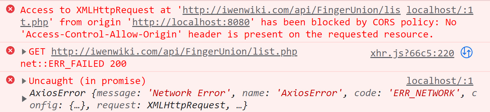


### 目前主流的跨域解决方案有两种：

1. 后台解决：cors
2. 前台解决：proxy

```js
devServer: {
    proxy: {
      '/api': {
        target: '<url>',
        changeOrigin: true
      }
    }
}
```

> **温馨提示**
>
> 解决完跨域配置之后，要记得重启服务器才行哦！


## Vue引入路由配置


在Vue中，我们可以通过`vue-router`路由管理页面之间的关系

Vue Router 是 Vue.js 的官方路由。它与 Vue.js 核心深度集成，让用 Vue.js 构建单页应用变得轻而易举


### 在Vue中引入路由

第一步：安装路由 `npm install --save vue-router`

第二步：配置独立的路由文件

```js
// index.js
import { createRouter, createWebHashHistory } from 'vue-router'
import HomeView from '../views/HomeView.vue'

const routes = [
  {
    path: '/',
    name: 'home',
    component: HomeView
  },
  {
    path: '/about',
    name: 'about',
    component: () => import('../views/AboutView.vue')
  }
]

const router = createRouter({
  history: createWebHashHistory(),
  routes
})

export default router
```

第三步：引入路由到项目

```js
// main.js
import router from './router'
app.use(router)
```

第四步：指定路由显示入口 `<router-view/>`

第五步：指定路由跳转

```vue
<router-link to="/">Home</router-link> |
<router-link to="/about">About</router-link>
```


## 路由传递参数


页面跳转过程中，是可以携带参数的，这也是很常见的业务

例如：在一个列表项，点击进入查看每个列表项的详情


第一步：在路由配置中指定参数的`key`

```js
{
    path:"/list/:name",
    name:"list",
    component:() => import("../views/ListView.vue")
}
```

第二步：在跳转过程中携带参数

```vue
<li><router-link to="/list/内蒙">内蒙旅游十大景区</router-link></li>
<li><router-link to="/list/北京">北京旅游十大景区</router-link></li>
<li><router-link to="/list/四川">四川旅游十大景区</router-link></li>
```

第三步：在详情页面读取路由携带的参数

```vue
<p>{{ $route.params.name }}城市旅游景区详情</p>
```


## 嵌套路由配置


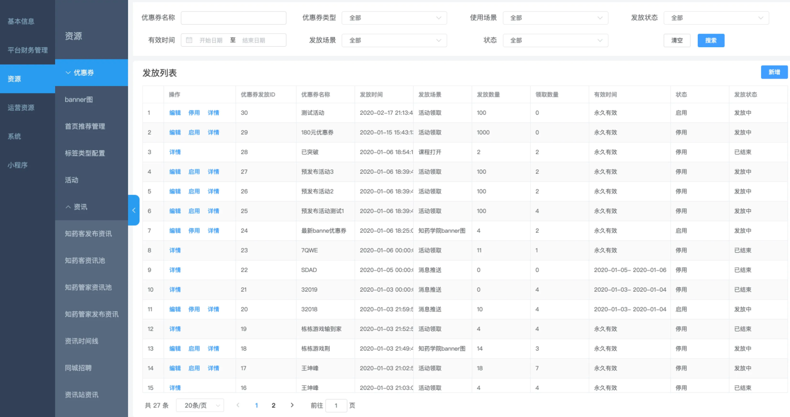


路由嵌套是非常常见的需求

第一步：创建子路由要加载显示的页面

第二步：在路由配置文件中添加子路由配置

```js
{
    path:"/news",
    name:"news",
    redirect:"/news/baidu",
    component:() => import("../views/NewsView.vue"),
    children:[
       {
       		path:"baidu",
            component:() => import("../views/NewsList/BaiduNews.vue"),
       },
       {
            path:"wangyi",
            component:() => import("../views/NewsList/WangyiNews.vue"),
       }
    ]
}
```

第三步：指定子路由显示位置`<router-view></router-view>`

第四步：添加子路由跳转链接

```vue
<router-link to="/news/baidu">百度新闻</router-link> | 
<router-link to="/news/wangyi">网易新闻</router-link>
```

第五步：重定向配置 `redirect:"/news/baidu"`


## Vue状态管理(Vuex)


Vuex 是一个专为 Vue.js 应用程序开发的**状态管理模式 + 库**。它采用集中式存储管理应用的所有组件的状态，并以相应的规则保证状态以一种可预测的方式发生变化。

简单来说，状态管理可以理解成为了更方便的管理组件之间的数据交互，提供了一个集中式的管理方案，任何组件都可以按照指定的方式进行读取和改变数据


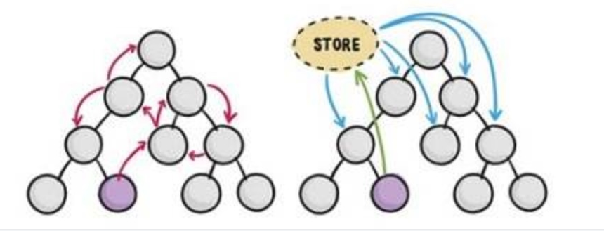


### 引入Vuex的步骤

第一步：安装Vuex `npm install --save vuex`

第二步：配置Vuex文件	

```js
import { createStore } from 'vuex'

export default createStore({
  state: {
      counter:0
  }
})
```

第三步：在主文件中引入Vuex

```js
import store from './store'
app.use(store)
```

第四步：在组件中读取状态

```vue
<p>counter:{{ $store.state.counter }}</p>
// 或者
import { mapState } from 'vuex';
computed:{
    ...mapState(["counter"])
}
```


## Vue状态管理核心(Vuex)


最常用的核心概念包含: `State`、`Getter`、`Mutation`、`Action`


### Getter

对Vuex中的数据进行过滤

```js
import { createStore } from 'vuex'

export default createStore({
  state: {
    counter: 0
  },
  getters: {
    getCount(state){
      return state.counter > 0 ? state.counter : "counter小于0，不符合要求"
    }
  }
})
```

```js
import { mapState,mapGetters } from 'vuex';
computed:{
    ...mapGetters(["getCount"])
}
```


### Mutation

更改 Vuex 的 store 中的状态的唯一方法是提交 mutation。Vuex 中的 mutation 非常类似于事件：每个 mutation 都有一个字符串的事件类型 (type)和一个回调函数 (handler)。这个回调函数就是我们实际进行状态更改的地方，并且它会接受 state 作为第一个参数

```js
import { createStore } from 'vuex'

export default createStore({
  state: {
    counter: 0
  },
  getters: {
  },
  mutations: {
    setCounter(state, num) {
      state.counter += num
    }
  }
})
```

```js
import { mapState,mapMutations } from 'vuex';

methods:{
    ...mapMutations(["setCounter"]),
    clickHandler(){
      // this.$store.commit("setCounter",20)
	  // 或者
      // this.setCounter(10)
    }
}
```


### Action

Action 类似于 mutation，不同在于：

- Action 提交的是 mutation，而不是直接变更状态
- Action 可以包含任意异步操作

```js
import { createStore } from 'vuex'
import axios from "axios"

export default createStore({
  state: {
    counter: 0
  },
  getters: {
    getCount(state){
      return state.counter > 0 ? state.counter : "counter小于0，不符合要求"
    }
  },
  mutations: {
    setCounter(state, num) {
      state.counter += num
    }
  },
  actions: {
    asyncSetCount({ commit }){
      axios.get("http://iwenwiki.com/api/generator/list.php")
      .then(res =>{
        commit("setCounter",res.data[0])
      })
    }
  }
})

```

```js
import { mapState,mapMutations,mapGetters,mapActions } from 'vuex';

methods:{
    ...mapActions(["asyncSetCount"]),
    clickAsyncHandler(){
        // this.$store.dispatch("asyncSetCount")
        // 或者
        // this.asyncSetCount()
    }
}
```


## Vue3新特性1


Vue3是目前Vue的最新版本，自然也是新增了很多新特性


### 六大亮点

- Performance：性能更比Vue 2.0强。
- Tree shaking support：可以将无用模块“剪辑”，仅打包需要的。
- **Composition API：组合API**
- Fragment, Teleport, Suspense：“碎片”，Teleport即Protal传送门，“悬念”
- Better TypeScript support：更优秀的Ts支持
- Custom Renderer API：暴露了自定义渲染API


### ref或者reactive

在2.x中通过组件data的方法来定义一些当前组件的数据

```js
data() {
  return {
    name: 'iwen',
    list: [],
  }
}
```

在3.x中通过ref或者reactive创建响应式对象

```js
import { ref,reactive } from "vue"
export default {
  name: 'HelloWorld',
  setup(){
      const name = ref("iwen")
      const state = reactive({
          list:[]
      })

    return{
        name,
        state
    }
  }
}
```


### methods中定义的方法写在setup()

在2.x中methods来定义一些当前组件内部方法

```js
methods:{
    http(){}
}
```

在3.x中直接在setup方法中定义并return

```js
setup() {
    const http = ()=>{
        // do something
    }
    return {
      http
    };
}
```


### setup()中使用props和context

在2.x中，组件的方法中可以通过this获取到当前组件的实例，并执行data变量的修改，方法的调用，组件的通信等等，但是在3.x中，setup()在beforeCreate和created时机就已调用，无法使用和2.x一样的this，但是可以通过接收setup(props,ctx)的方法，获取到当前组件的实例和props

```js
export default {
  props: {
    name: String,
  },
  setup(props,ctx) {
    console.log(props.name)
    ctx.emit('event')
  },
}
```


## Vue3新特性2


### 在setup中使生命周期函

你可以通过在生命周期钩子前面加上 “on” 来访问组件的生命周期钩子。

下表包含如何在 setup () 内部调用生命周期钩子

| Options API   | Hook inside setup |
| ------------- | ----------------- |
| beforeCreate  | Not needed*       |
| created       | Not needed*       |
| beforeMount   | onBeforeMount     |
| mounted       | onMounted         |
| beforeUpdate  | onBeforeUpdate    |
| updated       | onUpdated         |
| beforeUnmount | onBeforeUnmount   |
| unmounted     | onUnmounted       |

```js
export default {
  setup() {
    // mounted
    onMounted(() => {
      console.log('Component is mounted!')
    })
  }
}
```


### Provide / Inject

- provide() 和 inject() 可以实现嵌套组件之间的数据传递。
- 这两个函数只能在 setup() 函数中使用。
- 父级组件中使用 provide() 函数向下传递数据。
- 子级组件中使用 inject() 获取上层传递过来的数据。
- 不限层级 

```js
// 父组件
import { provide } from "vue"

setup() {
    provide("customVal", "我是父组件向子组件传递的值");
}
```

```js
// 子组件
import { inject } from "vue"

setup() {
    const customVal = inject("customVal");
    return {
      customVal
    }
}
```


### Fragment

Fragment翻译为：“碎片”

- 不再限于模板中的单个根节点

```vue
<template>
  
  <HelloWorld msg="Welcome to Your Vue.js App" />
</template>
```


## Vue3加载Element-plus


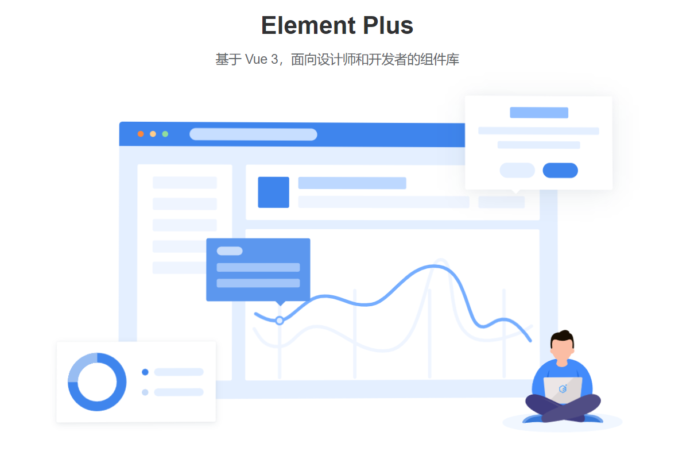


Element，一套为开发者、设计师和产品经理准备的基于 `Vue 2.0` 的桌面端组件库

Element Plus 基于 `Vue 3`，面向设计师和开发者的组件库


### 安装Element-Plus

```js
npm install element-plus --save
```


### 完整引用

如果你对打包后的文件大小不是很在乎，那么使用完整导入会更方便

```js
import { createApp } from 'vue'
import ElementPlus from 'element-plus'
import 'element-plus/dist/index.css'
import App from './App.vue'

const app = createApp(App)

app.use(ElementPlus)
app.mount('#app')
```


### 按需导入

按需导入才是我们的最爱，毕竟在真实的应用场景中并不是每个组件都会用到，这会造成不小的浪费

首先你需要安装`unplugin-vue-components` 和 `unplugin-auto-import`这两款插件

```js
npm install -D unplugin-vue-components unplugin-auto-import
```


然后修改`vue.config.js`配置文件

```js
const { defineConfig } = require('@vue/cli-service')
const AutoImport = require('unplugin-auto-import/webpack')
const Components = require('unplugin-vue-components/webpack')
const { ElementPlusResolver } = require('unplugin-vue-components/resolvers')

module.exports = defineConfig({
  transpileDependencies: true,
  configureWebpack: {
    plugins: [
      AutoImport({
        resolvers: [ElementPlusResolver()]
      }),
      Components({
        resolvers: [ElementPlusResolver()]
      })
    ]
  }
})
```


最后，可以直接在组件中使用

```html
<template>
	<el-button>Default</el-button>
	<el-button type="primary">Primary</el-button>
</template>
```


**实时效果反馈**

**1. 在Vue3项目中引入饿了么UI组件库，下来命令正确的是：**

<font style="background-color:rgb(233, 30, 100)">A</font>   `npm install --save element-iu`

<font style="background-color:rgb(255, 197, 10)">B</font>   `vue add element`

<font style="background-color:#8bc34a">C</font>   `npm install element-plus --save`

<font style="background-color:rgb(2, 170, 244);">D</font>   `vue add element-plus`


**答案**

1=>C


## Vue3加载Element-plus的字体图标


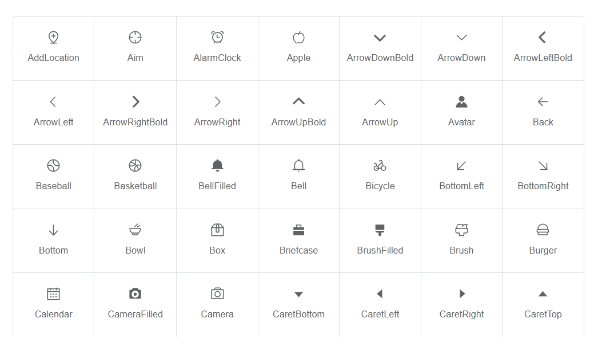


`Element-plus`不仅仅是提供了各种组件，同时还提供了一整套的字体图标方便开发者使用


### 安装`icons`字体图标

```js
npm install @element-plus/icons-vue
```


### 全局注册

在项目根目录下，创建`plugins`文件夹，在文件夹下创建文件`icons.js`文件

```js
import * as components from "@element-plus/icons-vue";
export default {
    install: (app) => {
        for (const key in components) {
            const componentConfig = components[key];
            app.component(componentConfig.name, componentConfig);
        }
    },
};
```


### 引入文件

在`main.js`中引入`icons.js`文件

```js
import elementIcon from "./plugins/icons";
app.use(elementIcon)
```


### 使用方式

接下来就可以直接在组件中引入使用了

```html
<el-icon class="expand" color="#409EFC" :size="30">
    <expand />
</el-icon>
```

