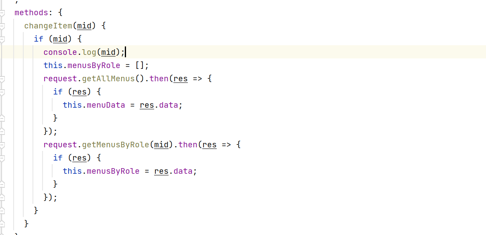

项目中遇到的问题

###### 关于登录过程中，动态加载路由，一些路由不需显示的问题 ：

解决办法：在特定的路由中加入hidden属性，通过判断值true/false

```js
import { createRouter, createWebHistory } from 'vue-router'


const routes = [
  {
    path: '/',
    name: 'login',
    hidden:false,
    component: () => import('../views/Login.vue')
  },
  {
    path: '/Home',
    name: 'Home',
    hidden:true,
    component: () => import('../components/Home.vue'),
    children:[
      {
        path:'/text',
        name:'Text',
        component:()=>import('../components/text.vue')
      }
    ]
  },
  {
    path:'/text2',
    name:'Text',
    hidden:true,
    component:()=>import('../components/text2.vue')
  }
]

const router = createRouter({
  history: createWebHistory(process.env.BASE_URL),
  routes
})

export default router
```

通过v-if实现判断

```vue
<el-aside width="200px">
                    <el-menu @select="handleOpen" v-for="(item,index) in this.$router.options.routes">
                        <el-sub-menu index="1" v-if="item.hidden">
                            <template #title>
                                <el-icon></el-icon>
                                <span>{{ item.name }}</span>
                            </template>
                            <el-menu-item :index="child.path" v-for="(child,indexj) in item.children">{{ child.name }}</el-menu-item>
                    </el-sub-menu>
                    </el-menu>
                </el-aside>
```

动态路由的添加，关于router.addRoutes();

新版VueRouter废除了addRoutes();//添加的数组
改为addRoute(RouteRecordRaw);//添加的为对象
原代码为：

```vue
const routers = store.getters.addRouters;
router.addRoutes(routers);
```

改为:

```vue
const routers = store.getters.addRouters;
routers.forEach((route) => {
  router.addRoute(route);
});
```

从数据库动态提取权限路由菜单这块：

```js
import request from "@/api/request";

export const initMenu = (router, store) => {
    request.menuinit().then(resp => {
        console.log(resp.data);
        let b=formatRoutes(resp.data);
        for(var i=0;i<b.length;i++){
            router.addRoute(b[i]);
        }
    })
}

// 此时参数routes是后端查询返回的路由参数
export const formatRoutes = (num) => {
    let rou = [];
    // 遍历routes 可以看到后端返回的数据是数组里面包含多个对象
    for (var i = 0; i < num.length; i++) {
        // 将menus里面的属性批量赋值给属性
        let {name, meta, path, component, iconCls, children} = num[i];
        if (num[i].children != null && num[i].children instanceof Array) {
            // 递归调用
            children = formatRoutes(num[i].children);
        }
        let fmRouter = {
            path: path,
            name: name,
            meta: meta,
            iconCls: iconCls,
            children: children,
            component: () => {
                if (component.startsWith('Emp')) {
                    import('../components/emp/' + component + '/.vue');
                } else if (component.startsWith('txt')) {
                    import('../components/per/' + component + '/.vue');
                } else if (component.startsWith('Per')) {
                    import('../components/per/' + component + '/.vue');
                } else if (component.startsWith('Sal')) {
                    import('../components/sal/' + component + '/.vue');
                } else if (component.startsWith('Sta')) {
                    import('../components/sta/' + component + '/.vue')
                } else if (component.startsWith('Sys')) {
                    import('../components/sys/' + component + '/.vue')
                }
            }
        };
        rou.push(fmRouter);
    }
    return rou;
}
```

获取当前路由路径的name

```js
router.currentRoute 相当于 $route

但是$route.path或者$route.fullPath只能在组件中用   

组件里头：`/user?a=10` $route.path === /user  $route.fullPath === /user?a=10

js模块中要使用 router.currentRoute

// js模块中：router.currentRoute.value.fullPath 就是当前路由地址

2.router.currentRoute是ref响应式数据 要拿值的话需要.value

3.encodeURIComponent 转换uri编码，防止解析地址出问题 用来解析获得的fullPath中的特殊字符

const fullPath = encodeURIComponent(router.currentRoute.value.fullPath)
```

###### 关于路由守卫

最近因为next()遇到了不少问题，在这里记录一下

首先是路由守卫，是不是感觉简简单单

```javascript
beforeEach((to, from, next) => {

	to // 要去的路由

	from // 当前路由

	next() // 放行的意思

}
```


但是在看别的项目时常常能看到next('/logon') 、 next(to) 或者 next({ ...to, replace: true }) 这又是啥意思呢

其实在路由守卫中，只有next()是放行，其他的诸如：next('/logon') 、 next(to) 或者 next({ ...to, replace: true })都不是放行，而是：中断当前导航，执行新的导航

可以这么理解：
next() 是放行，但是如果next()里有参数的话，next()就像被重载一样，就有了不同的功能。

而对于上面说的中断当前导航，执行新的导航打个比方：

现在我有一个守卫，在守卫中我使用next('/logon')，肯定有同学认为是会直接跳转到/logon路由：

```javascript
beforeEach((to, from, next) => {

  next('/logon')

}

```


然而年轻人不讲武德，执行时需要这么看：

```javascript
beforeEach((to, from, next) => {

  beforeEach(('/logon', from, next) => {

  	 beforeEach(('/logon', from, next) => {

  	 	 beforeEach(('/logon', from, next) => {

  	 	 	beforeEac...  // 一直循环下去...... , 因为我们没有使用 next() 放行

 		}

 	 }

  }

```


如果把这个守卫改一下，当我在地址栏输入/home时

```javascript
beforeEach((to, from, next) => {

   if(to.path === '/home') {

   	next('/logon')

   } else {

    // 如果要去的地方不是 /home ， 就放行

   	next()

   }

}

```


我本来要去/home路由，因此执行了第一次 beforeEach((to, from, next)

但是这个路由守卫中判断了如果要去的地方是'/home'，就执行next('/logon')，

所以想要访问/home可以这么看

```javascript
beforeEach((to, from, next) => {

   beforeEach(('/logon', from, next) => {

     next()  // 现在要去的地方不是 /home ， 因此放行

   }

}

```


注意：重点就在这，next('/logon')不是说直接去/logon路由，而是中断（不是CPU的那个中断！VUE中的中断就是此时不会执行router.afterEach(() => {}）这一次路由守卫的操作，又进入一次路由守卫，就像嵌套一样，一层路由守卫，然后又是一层路由守卫，此时路由守卫进入到第二层时，to.path已经不是/home了，这个时候才执行next()放行操作。

正以为如此很多人在使用动态添加路由addRoutes()会遇到下面的情况：
在addRoutes()之后第一次访问被添加的路由会白屏，这是因为刚刚addRoutes()就立刻访问被添加的路由，然而此时addRoutes()没有执行结束，因而找不到刚刚被添加的路由导致白屏。因此需要从新访问一次路由才行。

该如何解决这个问题 ?
此时就要使用next({ ...to, replace: true })来确保addRoutes()时动态添加的路由已经被完全加载上去。

next({ ...to, replace: true })中的replace: true只是一个设置信息，告诉VUE本次操作后，不能通过浏览器后退按钮，返回前一个路由。

因此next({ ...to, replace: true })可以写成next({ ...to })，不过你应该不希望用户在addRoutes()还没有完成的时候，可以点击浏览器回退按钮搞事情吧。

其实next({ ...to })的执行很简单，它会判断：

如果参数to不能找到对应的路由的话，就再执行一次beforeEach((to, from, next)直到其中的next({ ...to})能找到对应的路由为止。

也就是说此时addRoutes()已经完成啦，找到对应的路由之后，接下来将执行前往对应路由的beforeEach((to, from, next) ，因此需要用代码来判断这一次是否就是前往对应路由的beforeEach((to, from, next)，如果是，就执行next()放行。

如果守卫中没有正确的放行出口的话，会一直next({ ...to})进入死循环 !!!

因此你还需要确保在当addRoutes()已经完成时，所执行到的这一次beforeEach((to, from, next)中有一个正确的next()方向出口。

因此想实现动态添加路由的操作的话，代码应该是这样的：

```javascript
router.beforeEach((to, from, next) => {

 const token = sessionStorage.getItem('access_token')

 // 存在 token 说明已经登录

 if (token) {

   // 登录过就不能访问登录界面，需要中断这一次路由守卫，执行下一次路由守卫，并且下一次守卫的to是主页'

   if (to.path === '/login') {

     next({ path: '/' })

   }

   // 保存在store中路由不为空则放行 (如果执行了刷新操作，则 store 里的路由为空，此时需要重新添加路由)

   if (store.getters.getRoutes.length || to.name != null) {

     //放行

     next()

   } else {

     // 将路由添加到 store 中，用来标记已添加动态路由

     store.commit('ADD_ROUTER', '需要添加的路由')

     router.addRoutes('需要添加的路由')

     // 如果 addRoutes 并未完成，路由守卫会一层一层的执行执行，直到 addRoutes 完成，找到对应的路由

     next({ ...to, replace: true })

   }

 } else {

   // 未登录时，注意 ：在这里也许你的项目不只有 logon 不需要登录 ，register 等其他不需要登录的页面也需要处理

   if (to.path !== '/logon') {

     next({ path: '/logon' })

   } else {

     next()

   }

 }

```


万一还是听不懂，也可以next()比作Java Filter里的chain.doFilter(req, resp)
@WebFilter(filterName = "EncodingFilter", urlPatterns = "/*")
public class EncodingFilter implements Filter {

```java
@Override
public void doFilter(ServletRequest req, ServletResponse resp, FilterChain chain) throws ServletException, IOException {
    // 设置编码
    req.setCharacterEncoding("utf-8");
    resp.setContentType("text/html;charset=utf-8");
    chain.doFilter(req, resp);  // next()
}
```

}


###### 权限控制：

1.从前端发起的http请求，拿到http请求后，先分析地址与menu表里哪个url所匹配，menu表里的id对应menu_role里面的mid，根据mid查询menu_role里的rid(对应用户角色)

2.判读当前登录用户是否具有发来请求查出的角色，如果具备，则正常访问，不具备，则无权访问

###### 关于将mybatis的xml文件放在java目录下面的坑

1.在pom.xml文件中将java目录注册为资源目录

```xml
  <build>
            <resources>
                <resource>
                    <directory>src/main/java</directory>
                    <includes>
                        <include>**/*.xml</include>
                    </includes>
                    <filtering>true</filtering>
                </resource>
            </resources>
        <plugins>
            <plugin>
                <groupId>org.springframework.boot</groupId>
                <artifactId>spring-boot-maven-plugin</artifactId>
            </plugin>
        </plugins>
    </build>

```

2.textcolor{red}{springboot的配置文件的路径 由 . 改为 /

```xml
mybatis:
  type-aliases-package: com.example.springboot_shiro.entity
  mapper-locations: com/example/springboot_shiro/mapper/UserMapper.xml
```

3.关于el-tree节点与复选框展示问题

树节点的值与复选框的值因同时渲染



exceptionHandling方法

在 Spring Security 中，`exceptionHandling()` 方法是一个用于配置异常处理的方法。它允许开发人员自定义 Spring Security 在处理身份验证和授权方面出现的异常时的行为。

具体来说，`exceptionHandling()` 方法允许开发人员配置以下异常处理行为：

- `accessDeniedPage()`：配置访问被拒绝时要显示的页面。
- `accessDeniedHandler()`：配置一个自定义的 `AccessDeniedHandler`，用于处理访问被拒绝的情况。
- `authenticationEntryPoint()`：配置一个自定义的 `AuthenticationEntryPoint`，用于处理需要身份验证的资源的访问。
- `defaultAuthenticationEntryPointFor()`：配置一个默认的 `AuthenticationEntryPoint`，用于处理需要身份验证的资源的访问。
- `defaultAccessDeniedHandlerFor()`：配置一个默认的 `AccessDeniedHandler`，用于处理访问被拒绝的情况。

这些方法允许开发人员自定义 Spring Security 处理异常的方式，以便更好地适应他们的应用程序需求。

例如，以下代码演示了如何使用 `exceptionHandling()` 方法配置一个自定义的 `AccessDeniedHandler`：

```
@Configuration
@EnableWebSecurity
public class SecurityConfig extends WebSecurityConfigurerAdapter {

    @Override
    protected void configure(HttpSecurity http) throws Exception {
        http
            .authorizeRequests()
                .antMatchers("/admin/**").hasRole("ADMIN")
                .anyRequest().authenticated()
                .and()
            .exceptionHandling()
                .accessDeniedHandler(new CustomAccessDeniedHandler());
    }
}
```

在上面的代码中，我们首先使用 `authorizeRequests()` 方法配置了我们的身份验证和授权规则。然后，我们使用 `exceptionHandling()` 方法配置了一个自定义的 `AccessDeniedHandler`，它将在访问被拒绝时被调用。在这种情况下，我们使用了一个名为 `CustomAccessDeniedHandler` 的自定义类来处理访问被拒绝的情况。

###### vue里面的watch

在 Vue 中，`watch` 是一个用于监听数据变化并执行相应操作的功能。当你需要在数据变化时执行一些异步或开销较大的操作时，`watch` 是非常有用的。它可以监听一个特定的数据属性，并在该属性的值发生变化时执行回调函数。在回调函数中，你可以执行任何操作，例如更新视图、发送网络请求或执行其他操作。

`watch` 选项可以接收两个参数：要监听的属性和回调函数。当要监听的属性的值发生变化时，回调函数将被调用。回调函数接收两个参数：新值和旧值。你可以使用这些参数来执行相应的操作。例如，你可以比较新值和旧值，如果它们不同，就执行一些操作。

以下是一个示例，演示如何在 Vue 组件中使用 `watch`：

```javascript
export default {
  data() {
    return {
      message: 'Hello, world!'
    }
  },
  watch: {
    message(newVal, oldVal) {
      console.log(`New message: ${newVal}, Old message: ${oldVal}`)
    }
  }
}
```

在这个示例中，我们在组件中定义了一个 `message` 属性，并使用 `watch` 监听它的变化。当 `message` 的值发生变化时，回调函数将被调用，并输出新值和旧值到控制台。

默认回调函数名与v-model绑定的属于名一致,也可以自己mounted生命周期钩子函数使用`$watch`方法来监听`v-model`绑定的属性名

可以使用Vue.js提供的`$watch`方法来监听数据变化，并将回调函数的方法与`v-model`的属性名绑定。具体步骤如下：

1. 在Vue组件的`mounted`生命周期钩子函数中使用`$watch`方法来监听`v-model`绑定的属性名：

```
mounted() {
  this.$watch('propertyName', this.callbackFunction);
}
```

2. 在回调函数中处理数据变化的逻辑，比如更新组件的状态或向服务器发送请求：

```
methods: {
  callbackFunction(newValue, oldValue) {
    // 处理数据变化的逻辑
  }
}
```

这样，当`v-model`绑定的属性名发生变化时，绑定的回调函数就会被调用，从而实现数据的自动更新。

然而好像有问题，这个方法

```
watch:{
  department:'filterDepartment'
},
method:{
    // 这里是watch监听属性值变化的方法
    filterDepartment(value){
      console.log(value);
    }
```

###### 重新回顾vue的八个什么周期

Vue.js有8个生命周期函数，它们按照调用顺序依次为：

1. `beforeCreate`: 实例刚在内存中创建，此时还没有初始化好 `data` 和 `methods` 等属性。这个时候不能访问 `data` 和 `methods` 等属性，也不能使用 `this`。

2. `created`: 实例已经在内存中创建完成，此时 `data` 和 `methods` 等属性已经被初始化。可以访问 `data` 和 `methods` 等属性，并且可以使用 `this`。

3. `beforeMount`: 在挂载之前被调用，此时模板编译已经完成，但是还没有把编译后的模板挂载到页面上。

4. `mounted`: 在挂载之后被调用，此时编译后的模板已经被挂载到页面上，可以进行 DOM 操作。

5. `beforeUpdate`: 数据更新时调用，但是此时还没有重新渲染 DOM。

6. `updated`: 数据更新完成时调用，此时已经重新渲染 DOM。

7. `beforeDestroy`: 实例销毁之前调用，此时实例还可以被访问，可以进行一些清理工作。

8. `destroyed`: 实例销毁之后调用，此时实例已经被销毁，不能访问实例中的任何属性或方法。

通过这些生命周期函数，我们可以在不同的阶段执行不同的逻辑，比如在 `created` 钩子函数中初始化一些数据，在 `mounted` 钩子函数中进行 DOM 操作等。

###### 表连接

基本定义：
　　left join （左连接）：返回包括左表中的所有记录和右表中连接字段相等的记录。
　　right join （右连接）：返回包括右表中的所有记录和左表中连接字段相等的记录。
　　inner join （等值连接或者叫内连接）：只返回两个表中连接字段相等的行。
　　full join （全外连接）：返回左右表中所有的记录和左右表中连接字段相等的记录。
举个例子：　A表　　　　　　　　　　

　　id　  name　　

　　1　　小王

　　2　　小李

　　3　　小刘

　　B表

　　id　　A_id　　job

　　1　　2　　　　老师

　　2　　4　　　　程序员

内连接：（只有2张表匹配的行才能显示）

select a.name,b.job from A a  inner join B b on a.id=b.A_id

　　只能得到一条记录

　　小李　　老师

左连接：（左边的表不加限制）

select a.name,b.job from A a  left join B b on a.id=b.A_id

　　三条记录

　　小王　　null

　　小李　　老师

　　小刘　　null

右连接：（右边的表不加限制）

select a.name,b.job from A a  right join B b on a.id=b.A_id

　　两条记录

　　小李　　老师

　　null　　程序员

全外连接：(左右2张表都不加限制）

select a.name,b.job from A a  full join B b on a.id=b.A_id

　　四条数据

　　小王　　null

　　小李　　老师

　　小刘　　null

　　null　　程序员